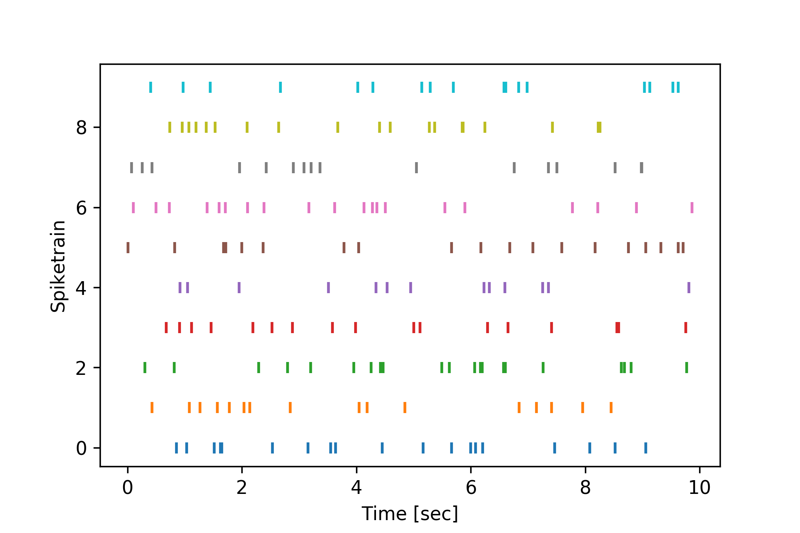
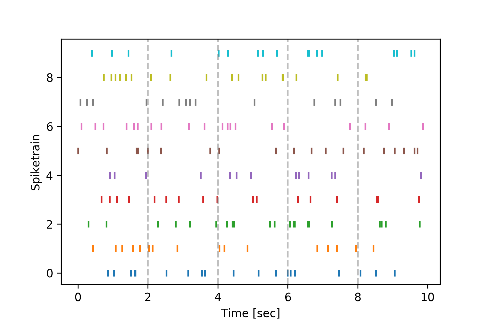
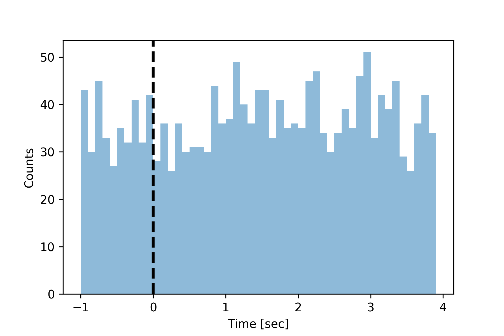

=============================
Spiketimes Numpy Tutorial 
=============================

The easiest way to get started with spiketimes is by working with numpy arrays. In this framework, a spiketrain is represented as a numpy array of spike times in seconds.

Generating Spiketrains
=========================

Spiketrains can be generated by simulation, or creation of surrogates of existing spiketrains or by loading in data files.

Simulating Spiketrains
~~~~~~~~~~~~~~~~~~~~~~~~

The :mod:`spiketimes.simulate` module contains functions for simulating spiketrains.

Lets simulate an irregular-spiking spiketrain with a constant firing rate. For this, we'll use the :func:`spiketimes.simulate.homogeneous_poisson_process` function.

::

    >>> from spiketimes.simulate import homogeneous_poisson_process
    >>>
    >>> st = homogeneous_poisson_process(rate=4, t_start=8, t_stop=10)
    >>> st
    array([8.05172817, 8.15086753, 8.22174441, 8.44837953, 8.66746485,
       8.7746017 , 8.94102246, 8.97722358, 9.2492881 , 9.52008361,
       9.5500119 , 9.7534826 , 9.83049717, 9.88975479])

We can also simulate spiketrains that change their firing rate over time. For example:

::

    >>> from spiketimes.simulate import imhomogeneous_poisson_process
    >>>
    >>>
    >>> imhomogeneous_poisson_process(time_rate=[(5, 0.5), (2, 5)], t_start=1)
    array([1.3895191 , 2.75733416, 3.79203384, 6.0275662 , 6.26492861,
       6.27737558, 6.57495924, 6.6764454 , 6.70029706, 6.76780677,
       6.96170539, 7.54483481, 7.56002437, 7.69575184, 7.74121035,
       7.92529903])

Generating Spiketrain Surrogates
~~~~~~~~~~~~~~~~~~~~~~~~~~~~~~~~~

The :mod:`spiketimes.surrogates` module contains functions for generating spiketrain surrogates. Surrogate spiketrains are randomly generated spiketrains which share some properties with a parent spiketrain but are otherwise different. They are often used for generating bootstrap replicates.

One of the most common types of spiketrain surrogates are shuffled inter-spike-interval (isi) surrogates. These spiketrains have identical isi distrobutions to their parent, but with shuffled order. They can be generated in spiketimes using the :func:`spiketimes.surrogates.shuffled_isi_spiketrain`: function.

::

    >>> from spiketimes.simulate import homogeneous_poisson_process
    >>> from spiketimes.surrogates import shuffled_isi_spiketrain
    >>>
    >>> original_spiketrain = homogeneous_poisson_process(rate=0.5, t_stop=30)
    >>> shuffled = shuffled_isi_spiketrain(original_spiketrain)

Jitter spiketrains are another common type of spiketrain surrogate. They share a similar pattern of time-varying firing rate as their parent, but with offset spiketimes. They can be generated in spiketimes using the :func:`spiketimes.surrogates.jitter_spiketrain`: function.

::

    >>> from spiketimes.surrogates import jitter_spiketrain
    >>> 
    >>> jittered = jitter_spiketrain(original_spiketrain, jitter_window_size=0.5)

Aligning and Binning Data
============================

One of the most common tasks in analysis of neuroscience experimental data is aligning data to events. The :mod:`spiketimes.alignment` and :mod:`spiketimes.binning` modules contain functions to align and bin data.

Data can be easily aligned to events using the :func:`spiketimes.alignment.align_around` function. This function is highly customisable. Check out all of its options in the :doc:`API Reference <array_api>`. See below for an example:

::

    >>> from spiketimes.simulate import homogeneous_poisson_process
    >>> from spiketimes.alignment import align_around
    >>> import numpy as np
    >>>
    >>>
    >>> events = np.arange(start=2, stop=14, step=4)
    >>> print(f"Events: \t{events}")
    Events: 	[ 2  6 10]
    >>> st = homogeneous_poisson_process(rate=1, t_stop=14, t_start=1)
    >>> print(f"Spiketimes: \t{st}")
    Spiketimes: 	[ 1.80323015  1.84967261  2.03991789  2.07067261  2.28136596  3.08029239
    3.30143406  3.63229053  4.08733938  4.17661091  4.86958822  5.51102716
    6.60802296  7.8849845   8.12873198 10.48377187 10.93672175 11.04330173
    11.30156375 11.34996232 11.59105221 11.90801207]
    >>> aligned_spiketimes = align_around(st, events, t_before=1, max_latency=5)
    >>> print(f"Aligned Spiketimes: \t{aligned_spiketimes}")
    Aligned Spiketimes: 	[-0.19676985 -0.15032739  0.03991789  0.07067261  0.28136596  1.08029239
    1.30143406  1.63229053  2.08733938  2.17661091  2.86958822 -0.48897284
    0.60802296  1.8849845   2.12873198  0.48377187  0.93672175  1.04330173
    1.30156375  1.34996232  1.59105221  1.90801207]

Spiketrains can be split into lists of spiketrains by trial using the :func:`spiketimes.alignment.split_by_trial` function:

::

    >>> from spiketimes.alignment import split_by_trial
    >>> 
    >>> trial_starts = np.array([5, 10])
    >>> st_list = split_by_trial(spiketrain=st, trial_starts=trial_starts)

To get spike counts at regular time bins, use the :func:`spiketimes.alignment.binned_spiketrain` function.

::

    >>> from spiketimes.alignment import binned_spiketrain
    >>> from spiketimes.simulate import homogeneous_poisson_process
    >>>
    >>> st = homogeneous_poisson_process(rate=4, t_start=0, t_stop=4)  # spiketrain with a constant 4Hz Firing rate
    >>> fs = 1  # sampling rate of binning (1 / bin width)
    >>> bin_edges, spike_counts = binned_spiketrain(st, fs=fs, t_start=0)  
    >>> print(f"Edges: \t{bin_edges}")  # bin_edges contain the right edges of the bins
    Edges: 	[1. 2. 3. 4.]
    >>> print(f"Spike Counts: \t {spike_counts}")  # spike_counts contains the number of spikes falling in that bin
    Spike Counts: 	 [6 1 8 2]

Or to get spike counts at arbitrary time bins, use the :func:`spiketimes.alignment.binned_spiketrain_bins_provided` function:

::

    >>> from spiketimes.alignment import binned_spiketrain_bins_provided
    >>> import numpy as np 
    >>> 
    >>> bins = np.arange(start=0, stop=4, step=0.02)
    >>> binned_st = binned_spiketrain_bins_provided(spiketrain=st, bins=bins)

To get spike counts in a time window following events, use the :func:`spiketimes.alignment.spike_count_around_event` function:

::

    >>> from spiketimes.alignment import spike_count_around_event
    >>> 
    >>> events = np.array([1.1, 2.4])  # event times in seconds
    >>> spike_counts = spike_count_around_event(spiketrain=st, events=events, binsize=0.3)

Statistics
============

The :mod:`spiketimes.statistics` provides a variety of functions for calculating spiketrain descriptive statistics.

To calculate the mean firing rate of a neuron, use the :func:`spiketimes.statistics.mean_firing_rate` function:

::

    >>> from spiketimes.statistics import mean_firing_rate
    >>> from spiketimes.simulate import homogeneous_poisson_process
    >>> 
    >>> st = homogeneous_poisson_process(rate=10, t_start=0, t_stop=120)  # neuron firing at 10Hz for 2 minutes
    >>> mean_firing_rate(st)
    10.13083858467599

To get a time-varying estimate of a neurons firing rate, use the :func:`spiketimes.statistics.ifr` function:

::

    >>> from spiketimes.statistics import ifr
    >>> 
    >>> fs = 1  # sampling rate at which to estimate firing rate
    >>> time_bins, firing_rate = ifr(st, fs=fs, as_df=False)

To get the inter-spike-intervals of a spiketrian, use the :func:`spiketimes.statistics.inter_spike_intervals` function.

::

    >>> from spiketimes.statistics import inter_spike_intervals
    >>> from spiketimes.simulate import homogeneous_poisson_process
    >>> 
    >>> st = homogeneous_poisson_process(rate=30, t_stop=60)
    >>> isi = inter_spike_intervals(st)

To calculate the coeficient of variation of inter-spike-intervals (a metric of spike regularity), use :func:`spiketimes.statistics.cv_isi`.

::

    >>> from spiketimes.statistics import cv_isi
    >>>
    >>> cv_isi(st)
    0.988

Correlating Spiketrains
==================================

The :mod:`spiketimes.correlate` module contains functions for correlating spiketrains.

To correlate spike counts in pairs of neurons, use :py:func:`spiketimes.correlate.spike_count_correlation`:

::

    >>> from spiketimes.correlate import spike_count_correlation
    >>> from spiketimes.simulate import imhomogeneous_poisson_process
    >>> 
    >>> # generate two spiketrains which shift their firing rates simultaneously
    >>> time_rate = [
    >>>     (120, 3),
    >>>     (60, 5),
    >>>     (120, 8),
    >>>     (60, 2),
    >>>     (120, 10)
    >>> ]
    >>> st1 = imhomogeneous_poisson_process(time_rate=time_rate)
    >>> st2 = imhomogeneous_poisson_process(time_rate=time_rate)
    >>> 
    >>> fs = 10  # sampling rate at which to use for correlation (1/binsize)
    >>> spike_count_correlation(st1, st2, binsize=0.1)
    0.1167

To test the significance of a correlation:

::

    >>> from spiketimes.correlate import spike_count_correlation_test
    >>> 
    >>> r, p = spike_count_correlation_test(st1, st2, binsize=binsize, n_boot=5000)
    >>> (r, p)
    (0.1167, 0.0272)

To calculate's a spiketrain's autocorrelation histogram, use the :func:`spiketimes.correlate.auto_corr` function:

::

    >>> from spiketimes.correlate import auto_corr
    >>> 
    >>> bins, values = auto_corr(st1, binsize=0.01, num_lags=50)

To calculate the crosscorelation histogram between two spiketrains, use the :func:`spiketimes.correlate.cross_corr` function:

::

    >>> from spiketimes.correlate import cross_corr
    >>> 
    >>> bins, values = cross_corr(st1, st2, binsize=0.01, num_lags=50)

Plots
==========

The :mod:`spiketimes.plots` module contains functions for plotting spiketrains.

To plot a raster containing multiple spiketrains, use the :func:`spiketimes.plots.raster` function:

..

    >>> from spiketimes.plots import raster
    >>> 
    >>> 
    >>> # create list of spiketrains firing at 2Hz for 10 seconds
    >>> spiketrain_list = [homogeneous_poisson_process(rate=2, t_start=0, t_stop=10) for _ in range(10)]
    >>> 
    >>> f, ax = plt.subplots()
    >>> ax = raster(spiketrain_list, ax=ax)  # create the plot
    >>> plt.show()

You can indicate event times by adding vertical lines to plots using the :func:`spiketimes.plots.add_event_vlines` function:

..

    >>> from spiketimes.plots import add_event_vlines
    >>> import numpy as np 
    >>> 
    >>> 
    >>> events = np.array([2, 4, 6, 8])
    >>> 
    >>> f, ax = plt.subplots()
    >>> ax = raster(spiketrain_list, ax=ax)  # create the initial plot
    >>> # add vertical lines indicating event timings
    >>> ax = add_event_vlines(ax=ax, events=events, vline_kwargs={"alpha": 0.5})  
    >>> plt.show()

Construct peri-stimulus time histograms using the :func:`spiketimes.plots.psth` function.

::

    >>> from spiketimes.plots import psth, add_event_vlines
    >>> 
    >>> # generate random neuron
    >>> st = homogeneous_poisson_process(rate=10, t_stop=1000)
    >>> 
    >>> # generate some events
    >>> events = np.arange(0, 180, 5)
    >>> 
    >>> # plot the psth
    >>> ax = psth(st, events, binwidth=0.1, t_before=1, max_latency=4)

